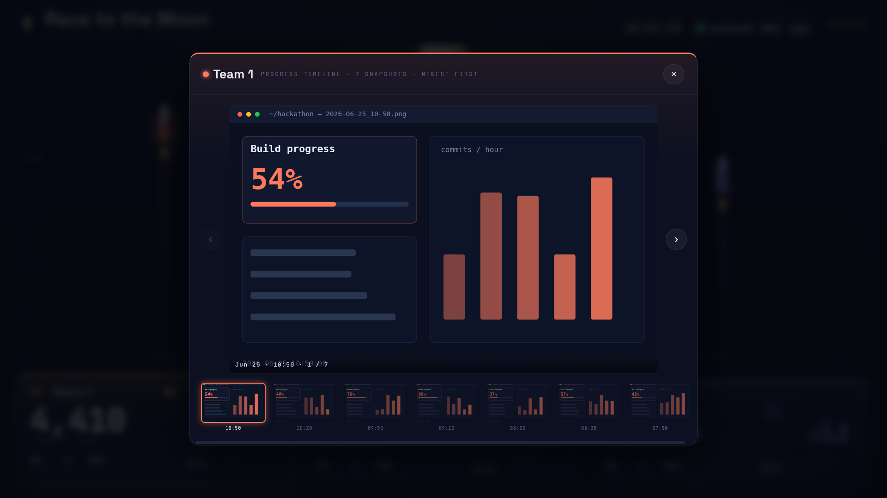

# 🚀 Race to the Moon

A live hackathon leaderboard for the big screen in the room. Each team is a
rocket climbing toward the moon — the more lines of code they commit, the higher
they fly. First place is always crowned in gold.

Built as a mission-control telemetry board: rockets climb a shared altitude
gauge, and each team's console shows lines of code, commits, crew size and time
since their last push. It refreshes itself, so you can put it on a monitor and
forget about it.


---

## Quick start (demo mode)

You can see the whole thing running in 30 seconds with built-in demo data — no
GitHub token needed.

```bash
npm install
npm start
```

Open **http://localhost:4000** and put the browser in fullscreen (F11). The
numbers climb on their own so you can confirm everything looks right.

> Demo mode kicks in automatically whenever no GitHub token is configured. A
> small **“Demo data”** badge appears top-right so you never confuse it with the
> real thing.

---

## Going live with the real repos

The three hackathon repos are private, so the dashboard needs a GitHub token to
read them. The token stays on the server — it is never sent to the browser.

**1. Create a token** at <https://github.com/settings/tokens>

- *Recommended:* a **fine-grained token** with **Repository access** limited to
  the three `Westpress/hackathon-2026-team-*` repos and **Contents: Read-only**.
- *Or:* a **classic token** with the **`repo`** scope.

**2. Add it to a `.env` file** (copy the template first):

```bash
cp .env.example .env
```

Then edit `.env`:

```ini
GITHUB_TOKEN=github_pat_xxxxxxxxxxxxxxxxxxxxx
PORT=4000
```

**3. Restart** (`npm start`). The console will say `mode: LIVE GitHub data` and
the rockets will start tracking real commits. Data refreshes every 30 seconds.

---

## Configuration

Everything lives in **`config.json`** — no code changes needed.

```json
{
  "event": "Hackathon 2026",
  "org": "Westpress",
  "owner": "Westpress",
  "hackathonStart": null,
  "teams": [
    { "id": "team1", "name": "Team 1", "repo": "hackathon-2026-team-1", "color": "#FF7A5C" },
    { "id": "team2", "name": "Team 2", "repo": "hackathon-2026-team-2", "color": "#4FD8C4" },
    { "id": "team3", "name": "Team 3", "repo": "hackathon-2026-team-3", "color": "#A98BFF" }
  ]
}
```

| Field            | What it does                                                                 |
|------------------|------------------------------------------------------------------------------|
| `name`           | The team name shown on the console — rename to your real team names.         |
| `repo`           | The repository name under `owner`.                                           |
| `color`          | The rocket + console accent color (any CSS color).                           |
| `hackathonStart` | Set to an ISO time like `"2026-06-24T09:00:00"` to turn the header clock into a **mission timer** (`T+ 04:21:07`). Leave `null` to show the wall clock. |

Adding a fourth team is just another entry in `teams` — the layout adapts.

Environment variables (in `.env`) let you tweak `PORT`, `REFRESH_MS` (how often
GitHub is polled, default 30s), and `DEMO=1` to force demo data even with a
token set.

---

## Deploying on a Linux VM (from scratch)

This runs the dashboard as a small always-on service on a Linux VM. The room's
monitor then just opens the VM's URL in a browser. Commands below are for
Ubuntu/Debian (`apt`); swap the package manager for other distros.

### What you need

| Dependency | Why | Version |
|------------|-----|---------|
| **Node.js** | runs the server (`server.js`) | **18 or newer** — 20 LTS recommended |
| **npm** | installs the app's packages | ships with Node.js |
| **git** | to clone the project onto the VM | any |
| **A GitHub token** | read the private repos (see "Going live" above) | — |

The app's own packages — `express` and `dotenv` — are pulled in by
`npm install`; you don't install them by hand.

### 1. Connect to the VM

```bash
ssh youruser@your-vm-ip
```

### 2. Install git and Node.js

```bash
# git
sudo apt-get update && sudo apt-get install -y git

# Node.js 20 LTS (via NodeSource — installs node + npm system-wide)
curl -fsSL https://deb.nodesource.com/setup_20.x | sudo -E bash -
sudo apt-get install -y nodejs

# confirm
node --version   # should print v20.x (or v18+)
npm --version
```

### 3. Get the code onto the VM

Clone it from the repo:

```bash
cd ~
git clone https://github.com/Westpress/hackathon-github-tracker.git race-to-the-moon
cd race-to-the-moon
```

This repo is private, so git will ask you to authenticate. Easiest is to embed
a token in the clone URL (a GitHub token with read access to this repo — the
same one works):

```bash
git clone https://<TOKEN>@github.com/Westpress/hackathon-github-tracker.git race-to-the-moon
```

Or skip git entirely and copy it from your machine:

```bash
# run this on your local machine
rsync -av --exclude node_modules --exclude .env ./github-tracker/ youruser@your-vm-ip:~/race-to-the-moon/
```

### 4. Install the app's packages

```bash
npm install
```

### 5. Configure your token

```bash
cp .env.example .env
nano .env            # set GITHUB_TOKEN=...  (and PORT if you want something other than 4000)
```

`.env` is git-ignored, so your token never leaves the VM.

### 6. Smoke test

```bash
npm start
```

You should see `mode: LIVE GitHub data`. From another machine on the same
network, open `http://your-vm-ip:4000` to confirm it loads, then stop it with
`Ctrl-C`.

### 7. Run it as a service (auto-start, auto-restart)

So it survives reboots and keeps running after you log out. Create the unit
file (adjust `User` and the paths to match your user and clone location):

```bash
sudo tee /etc/systemd/system/race-to-the-moon.service > /dev/null <<'EOF'
[Unit]
Description=Race to the Moon dashboard
After=network-online.target
Wants=network-online.target

[Service]
Type=simple
User=youruser
WorkingDirectory=/home/youruser/race-to-the-moon
ExecStart=/usr/bin/node server.js
Restart=always
RestartSec=5

[Install]
WantedBy=multi-user.target
EOF
```

> `ExecStart` needs the absolute path to node — check yours with `which node`
> (NodeSource installs it at `/usr/bin/node`). The service reads `.env` from
> `WorkingDirectory`, so keep that pointed at the clone.

Enable and start it:

```bash
sudo systemctl daemon-reload
sudo systemctl enable --now race-to-the-moon
sudo systemctl status race-to-the-moon        # should say "active (running)"
journalctl -u race-to-the-moon -f             # live logs (Ctrl-C to stop tailing)
```

### 8. Open the port in the firewall

If `ufw` is enabled on the VM:

```bash
sudo ufw allow 4000/tcp
```

(Cloud VMs — AWS/Azure/GCP — also need port 4000 allowed in their security
group / network firewall.)

### 9. Point the room display at it

On the machine driving the monitor, open Chrome in kiosk mode at the VM:

```bash
google-chrome --kiosk --app=http://your-vm-ip:4000
```

That's all it needs — the page refreshes itself.

**Optional — serve it on plain port 80** (so the URL is just `http://your-vm-ip`)
with nginx as a reverse proxy:

```bash
sudo apt-get install -y nginx
sudo tee /etc/nginx/sites-available/race-to-the-moon > /dev/null <<'EOF'
server {
    listen 80;
    server_name _;
    location / {
        proxy_pass http://127.0.0.1:4000;
        proxy_set_header Host $host;
    }
}
EOF
sudo ln -sf /etc/nginx/sites-available/race-to-the-moon /etc/nginx/sites-enabled/
sudo nginx -t && sudo systemctl reload nginx
sudo ufw allow 80/tcp
```

### Updating later

```bash
cd ~/race-to-the-moon
git pull                # or rsync again
npm install             # only if dependencies changed
sudo systemctl restart race-to-the-moon
```

---

## Putting it on the monitor

- **Fullscreen:** open the URL and press **F11**, or launch Chrome in kiosk mode:
  ```bash
  google-chrome --kiosk --app=http://localhost:4000
  ```
- The page polls the server every 12s and the server polls GitHub every 30s, so
  it stays current with no interaction. Leave the tab open all day.
- It's designed for a 1080p landscape screen and scales to other sizes.
- Respects `prefers-reduced-motion` if anyone needs the animations toned down.

---

## How the numbers are measured

| Stat            | Source                                                                 |
|-----------------|------------------------------------------------------------------------|
| **Lines of code** (rocket altitude) | Total additions on the repo's **default branch**, from GitHub's contributor statistics. |
| **Commits**     | Total commits across all contributors.                                 |
| **Crew**        | Number of distinct contributors.                                       |
| **Last push**   | Time of the most recent commit.                                        |

A few things worth knowing:

- Only the **default branch** counts. If teams work on feature branches, their
  lines show up once merged into `main`.
- GitHub computes the contributor stats in the background. Right after the very
  first commits you may briefly see **“Calibrating”** — it resolves within a
  minute or two and the rockets launch.
- If a repo can't be reached, that team shows **“No signal”** and the dashboard
  keeps the last good numbers rather than dropping the rocket back to the pad.

---

## Progress screenshots

Each console card shows a small **porthole** preview of the team's latest
progress screenshot. Click it to open a **history lightbox** — a timeline of all
their snapshots with prev/next arrows, a filmstrip, and keyboard navigation
(← / →, Esc to close).



**How teams add screenshots:** commit image files into a `screenshots/` folder
at the repo root, e.g.
`github.com/Westpress/hackathon-2026-team-1/tree/main/screenshots`. A new file
every ~30 minutes builds the timeline. `.png`, `.jpg`, `.gif` and `.webp` are
all picked up.

**Name them by time so the timeline reads nicely.** The dashboard pulls the
timestamp straight out of the filename:

```
2026-06-25_14-30.png   →  shows "14:30"
2026-06-25T1430.png    →  shows "14:30"
progress-07.png        →  no time found, shows the filename instead
```

A tiny capture-and-commit loop a team can run on their machine:

```bash
while true; do
  ts=$(date +%Y-%m-%d_%H-%M)
  scrot "screenshots/$ts.png"          # or: screencapture (macOS), grim (Wayland)
  git add screenshots && git commit -m "progress $ts" && git push
  sleep 1800                            # 30 minutes
done
```

**Private repos stay private.** The browser never sees your GitHub token. The
server fetches each image with the token and streams it to the page through
`/api/shot/...`, and it will only serve filenames that actually exist in a
team's `screenshots/` folder (so the proxy can't be used to read anything else).
Images are cached, so opening a history doesn't re-hit GitHub each time.

The folder name defaults to `screenshots` and can be changed via
`screenshotsFolder` in `config.json` (or `SCREENSHOTS_DIR` in `.env`).

---

## Project layout

```
server.js          Express server — pulls from GitHub, caches, serves the API
config.json        Teams, repos, colors, event details
public/
  index.html       Page structure
  styles.css       The whole visual system (space + mission-control theme)
  app.js           Polling, ranking, rockets, readouts, starfield, screenshot lightbox
.env.example       Copy to .env and add your token
```

Made for the “To the Moon” hackathon. 🌙
