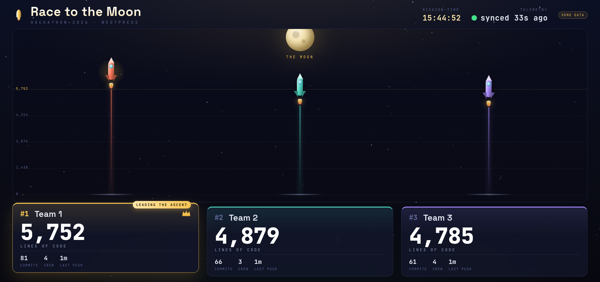

# 🚀 Race to the Moon

A live hackathon leaderboard for the big screen in the room. Each team is a
rocket climbing toward the moon — the more lines of code they commit, the higher
they fly. First place is always crowned in gold.

Built as a mission-control telemetry board: rockets climb a shared altitude
gauge, and each team's console shows lines of code, commits, crew size and time
since their last push. It refreshes itself, so you can put it on a monitor and
forget about it.



---

## Quick start (demo mode)

You can see the whole thing running in 30 seconds with built-in demo data — no
GitHub token needed.

```bash
npm install
npm start
```

Open **http://localhost:4000** and put the browser in fullscreen (F11). The
numbers climb on their own so you can confirm everything looks right.

> Demo mode kicks in automatically whenever no GitHub token is configured. A
> small **“Demo data”** badge appears top-right so you never confuse it with the
> real thing.

---

## Going live with the real repos

The three hackathon repos are private, so the dashboard needs a GitHub token to
read them. The token stays on the server — it is never sent to the browser.

**1. Create a token** at <https://github.com/settings/tokens>

- *Recommended:* a **fine-grained token** with **Repository access** limited to
  the three `Westpress/hackathon-2026-team-*` repos and **Contents: Read-only**.
- *Or:* a **classic token** with the **`repo`** scope.

**2. Add it to a `.env` file** (copy the template first):

```bash
cp .env.example .env
```

Then edit `.env`:

```ini
GITHUB_TOKEN=github_pat_xxxxxxxxxxxxxxxxxxxxx
PORT=4000
```

**3. Restart** (`npm start`). The console will say `mode: LIVE GitHub data` and
the rockets will start tracking real commits. Data refreshes every 30 seconds.

---

## Configuration

Everything lives in **`config.json`** — no code changes needed.

```json
{
  "event": "Hackathon 2026",
  "org": "Westpress",
  "owner": "Westpress",
  "hackathonStart": null,
  "teams": [
    { "id": "team1", "name": "Team 1", "repo": "hackathon-2026-team-1", "color": "#FF7A5C" },
    { "id": "team2", "name": "Team 2", "repo": "hackathon-2026-team-2", "color": "#4FD8C4" },
    { "id": "team3", "name": "Team 3", "repo": "hackathon-2026-team-3", "color": "#A98BFF" }
  ]
}
```

| Field            | What it does                                                                 |
|------------------|------------------------------------------------------------------------------|
| `name`           | The team name shown on the console — rename to your real team names.         |
| `repo`           | The repository name under `owner`.                                           |
| `color`          | The rocket + console accent color (any CSS color).                           |
| `hackathonStart` | Set to an ISO time like `"2026-06-24T09:00:00"` to turn the header clock into a **mission timer** (`T+ 04:21:07`). Leave `null` to show the wall clock. |

Adding a fourth team is just another entry in `teams` — the layout adapts.

Environment variables (in `.env`) let you tweak `PORT`, `REFRESH_MS` (how often
GitHub is polled, default 30s), and `DEMO=1` to force demo data even with a
token set.

---

## Putting it on the monitor

- **Fullscreen:** open the URL and press **F11**, or launch Chrome in kiosk mode:
  ```bash
  google-chrome --kiosk --app=http://localhost:4000
  ```
- The page polls the server every 12s and the server polls GitHub every 30s, so
  it stays current with no interaction. Leave the tab open all day.
- It's designed for a 1080p landscape screen and scales to other sizes.
- Respects `prefers-reduced-motion` if anyone needs the animations toned down.

---

## How the numbers are measured

| Stat            | Source                                                                 |
|-----------------|------------------------------------------------------------------------|
| **Lines of code** (rocket altitude) | Total additions on the repo's **default branch**, from GitHub's contributor statistics. |
| **Commits**     | Total commits across all contributors.                                 |
| **Crew**        | Number of distinct contributors.                                       |
| **Last push**   | Time of the most recent commit.                                        |

A few things worth knowing:

- Only the **default branch** counts. If teams work on feature branches, their
  lines show up once merged into `main`.
- GitHub computes the contributor stats in the background. Right after the very
  first commits you may briefly see **“Calibrating”** — it resolves within a
  minute or two and the rockets launch.
- If a repo can't be reached, that team shows **“No signal”** and the dashboard
  keeps the last good numbers rather than dropping the rocket back to the pad.

---

## Project layout

```
server.js          Express server — pulls from GitHub, caches, serves the API
config.json        Teams, repos, colors, event details
public/
  index.html       Page structure
  styles.css       The whole visual system (space + mission-control theme)
  app.js           Polling, ranking, rockets, count-up readouts, starfield
.env.example       Copy to .env and add your token
```

Made for the “To the Moon” hackathon. 🌙
